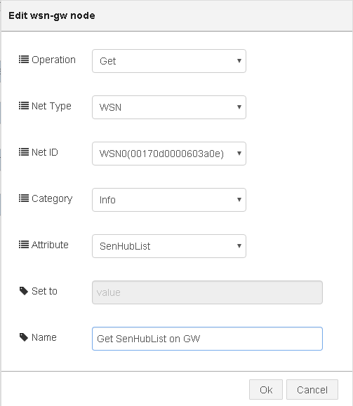
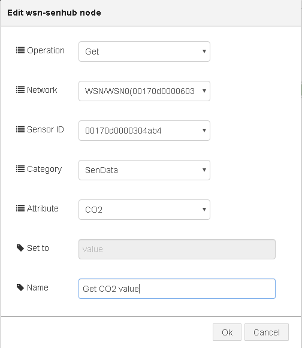

# node-red-contrib-wsn
A collection of [Node-RED](http://nodered.org) nodes to Access ADVANTECH  Wireless Sensor Network (WSN) APIs.

## Install
Use npm to command to install this package locally in the Node-RED modules directory
```bash
npm install node-red-contrib-wsn 
```
or install in it globally with the command
```bash
npm install node-red-contrib-wsn -g 
```

## Nodes included in the package
**wsn-gw** Get/Set information for WSN gateways.

**wsn-senhub** Get/Set information for remote SensorHubs, e.g. WISE-1020, controlled by WSN gateway.

## Usage example
**[wsn-gw]**




- **Operation :** Get or Set
- **Net Type :** Supported network types on the platform
- **Net ID :** List of available network interfaces of selected *Net Type* above. Options are listed in the format of : ***Interface Name ( Interface MAC )***. Ex: WSN0(00170d0000010203)
- **Category :** Class of Attributes
- **Attribute :** List of Attributes in selected *Category* above
- **Set to :** Place for entering value when Operation is *Set*
- **Name :** *(Optional)* Place for entering the name of this node

---
**[wsn-senhub]**




- **Operation :** Get or Set
- **NetWork :** List of available network interfaces. Options are listed in the format of : ***Network Type/Interface Name ( Interface MAC )***. Ex. WSN/WSN0(00170d0000010203)
- **Sensor ID :** List of available SensorHub MAC address on *network* interface selected above.
- **Category :** Class of Attributes
- **Attribute :** List of Attributes in selected *Category* above
- **Set to :** Place for entering value when Operation is *Set*
- **Name :** *(optional)* Place for entering the name of this node

## Tested Platform 
- Linux (Yocto 1.5/1.7)
 
## History
- 0.2.1 - June 2016 : Initial Release

## License
Copyright 2016 ADVANTECH Corp. under [the Apache 2.0 license](LICENSE).